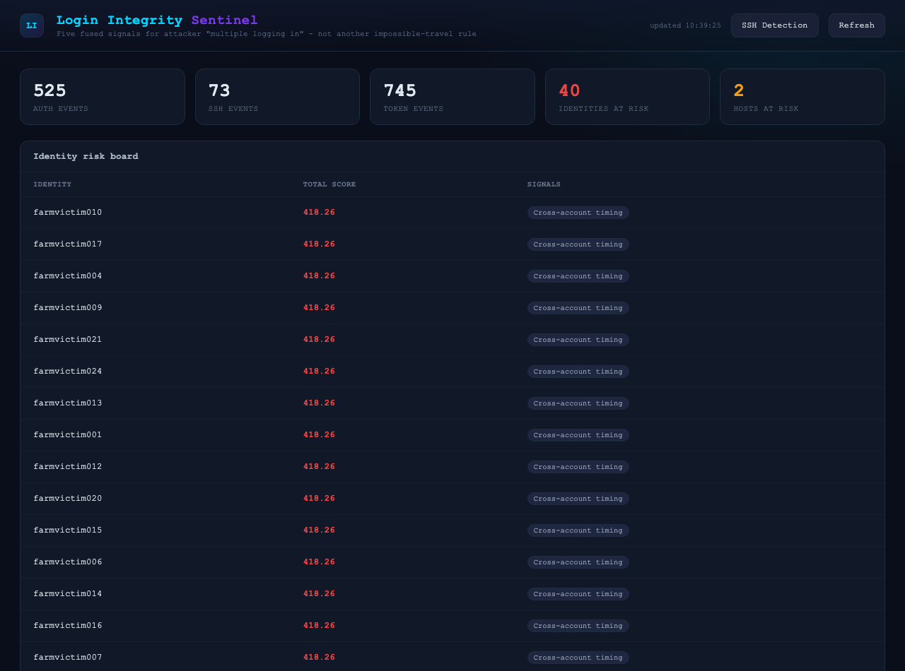
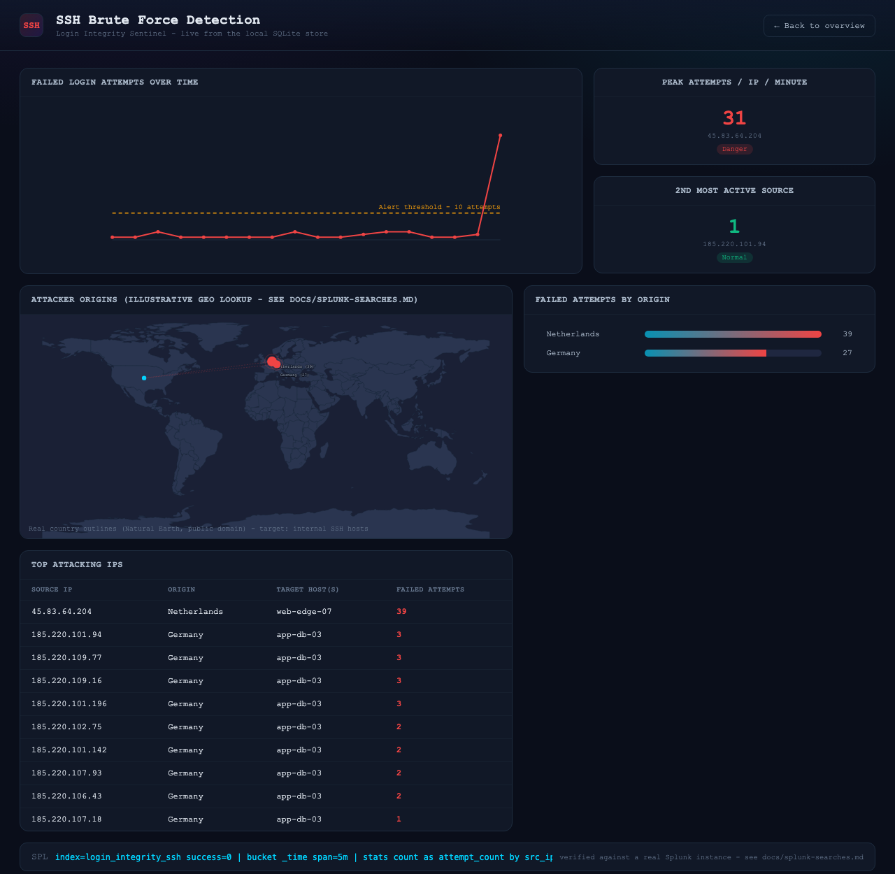
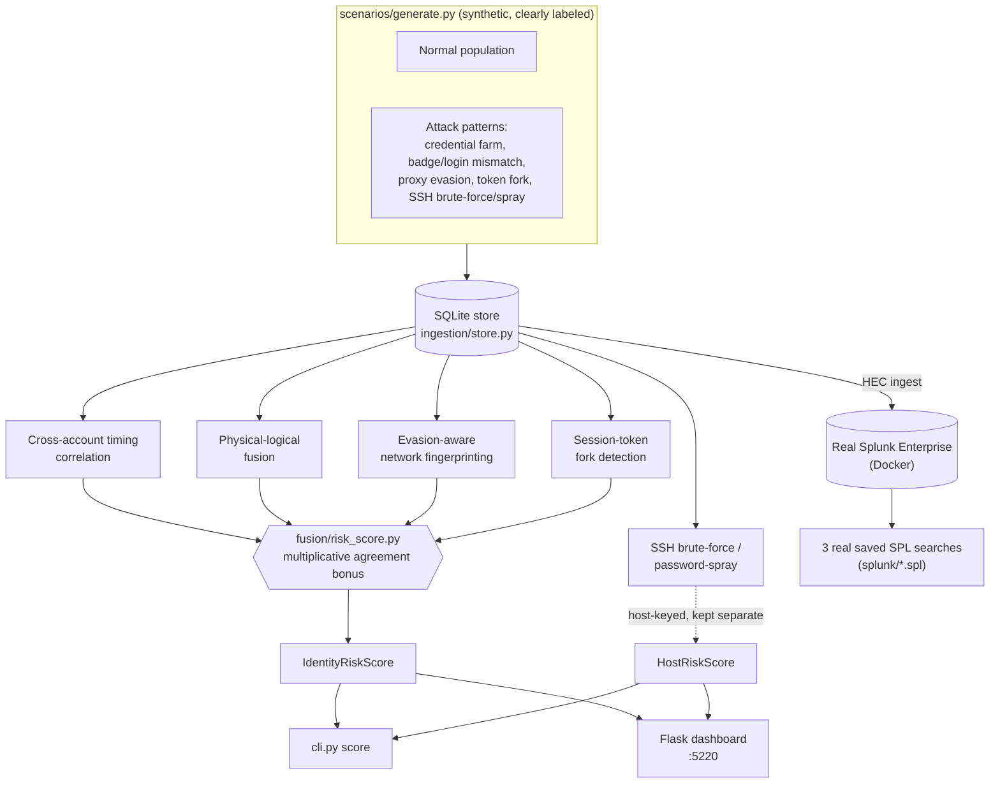

# Login Integrity Sentinel

[](https://github.com/Abhishek-Sidde-Gowda/login-integrity-sentinel)
[](tests/)
[](docs/splunk-searches.md)
[](requirements.txt)

Detects attacker-controlled "multiple logging in" activity - credential
farms, session/token theft, and physical-logical identity spoofing -
by fusing five signals almost nothing combines into one score, instead
of one more impossible-travel rule.

This is the 9th tool in a security portfolio. See the wider portfolio's
build order in the sibling tool READMEs (network-traffic-analyzer,
purple-team-platform, ai-soc-homelab, argus, iam-drift-sentinel).

## Screenshots

**Fused identity/host risk board**, sorted by score, with click-through
evidence detail:



**SSH Brute Force Detection view** - failed-attempts timeline with an
alert threshold, peak-rate gauges, a real-geography attacker-origin
map, and the top attacking IPs:



## Architecture



Two signals (physical-logical fusion, token forks) exist only in the
Python fusion engine - they're joins/lineage graphs Python expresses
more directly than SPL. The other three (cross-account timing, SSH
brute force, SSH password spray) run as **both** a Python detector and
a real, verified Splunk saved search - see [docs/splunk-searches.md](docs/splunk-searches.md).

## Why this exists

Standard SIEM content (including Splunk's own Security Essentials app)
already covers impossible travel, concurrent-session thresholds, and
per-IP brute-force counters well. Those are per-event or per-account
rules. The five signals here are deliberately population-level or
cross-signal instead:

1. **Cross-account login-timing correlation** - many *unrelated*
   accounts authenticating within a tight synchronized window, repeated
   over time. Invisible to per-account anomaly detection, since each
   individual login looks normal; visible only across the population.
2. **Physical-logical identity fusion** - a badge read places a user in
   one building; moments later a login originates from a network
   segment mapped to a different building. Physical presence can't be
   VPN-spoofed the way an IP can.
3. **Evasion-aware network fingerprinting** - claimed geolocation looks
   local, but measured RTT is far higher than physically plausible for
   that distance - consistent with a residential-proxy relay spoofing
   geolocation to defeat impossible-travel rules that trust geoIP alone.
4. **Session-token fork detection** - one OAuth refresh token spawning
   access tokens used from divergent device/IP pairs concurrently. A
   legitimate client's token lineage never forks this way.
5. **SSH low-and-slow password-spray detection** - many distinct source
   IPs, each trying a handful of common usernames a few times over
   hours, all against the same host. No single IP or account crosses a
   naive per-entity failure threshold; the signal only exists at the
   population level (unusual fan-out of `(src_ip, username)` pairs
   against one target in one window). A classic single-source brute
   force is included too, as the baseline case this is designed to beat.

## Honesty notes on data sources

- **Badge/RFID events (signal 2) are explicitly synthetic.** This
  portfolio's [rfid-usb-correlation-engine](../rfid-usb-correlation-engine)
  tool has no hardware acquired yet and is still in planning status -
  this tool does not claim a live physical-access integration it
  doesn't have. Generated in `scenarios/generate.py` and labeled as
  such throughout; the fusion logic is written so real reader hardware
  could be dropped in later without changing anything downstream.
- **The attacker-origin geolocation (`ingestion/geo_lookup.py`) is a
  small illustrative lookup table**, not a real GeoIP integration -
  covers only the synthetic IP ranges the scenario generator uses,
  with genuine real-world reference points where one exists
  (185.220.100-110.x is a well-known Tor exit-relay range).
- **The world map itself (`web/static/world_land_path.txt`) is real**:
  generated from Natural Earth's public-domain 1:110m country boundary
  data, reprojected with the exact formula the dashboard uses to plot
  markers - see [docs/world-map-data.md](docs/world-map-data.md) for
  why that mattered (an earlier attempt using an existing map SVG
  silently misplaced markers by ~10 degrees of longitude).
- **Splunk is a real Splunk Enterprise instance, not mocked** - running
  locally via the official `splunk/splunk` Docker image (trial
  license, Splunk's General Terms accepted explicitly before first
  run). See [docs/splunk-docker.md](docs/splunk-docker.md) for the
  container setup and [docs/splunk-searches.md](docs/splunk-searches.md)
  for the live-verified saved searches.

## Status - all 10 phases complete

**47/47 tests passing.** Five independent detection signals, fused
into one risk score, verified against both synthetic data and a real
Splunk instance. Every phase below was individually tested and
verified before the next one started.

- [x] **Phase 1 - Foundation**
  - Event schemas (`AuthEvent`, `BadgeEvent`, `TokenEvent`, `NetworkFingerprint`, `SSHAuthEvent`) in `ingestion/schema.py`
  - SQLite mirror store (`ingestion/store.py`) the detection layer queries directly, independent of Splunk
  - Synthetic scenario generator (`scenarios/generate.py`): a normal population plus one injected attack per signal
  - Splunk HEC/REST client (`ingestion/splunk_client.py`) - live-verified against a real Dockerized Splunk instance
  - 8/8 tests passing
- [x] **Phase 2 - Cross-account timing correlation** (signal 1)
  - O(n) two-pointer sliding window finds bursts of anomalous distinct-user logins, scores against a cold baseline, flags recurring bursts (Jaccard >= 0.5) as higher risk
  - **Bug found & fixed:** a leave-one-out baseline only excluded each burst's own windows, letting a second recurring burst damp the first burst's z-score (1.88 instead of >200) - fixed with one shared baseline excluding every detected burst
  - 12/12 tests passing; all 6 injected farm bursts detected, zero false positives
- [x] **Phase 3 - Physical-logical fusion** (signal 2)
  - Bisects each user's badge history for the most recent read before a login; flags a mismatch when that badge's building differs from the login's network-segment building
  - 4-hour staleness window; logins from unmapped IPs correctly skipped, not treated as a match
  - 18/18 tests passing; exactly the 5 injected mismatches detected, zero false positives
- [x] **Phase 4 - Evasion-aware network fingerprinting** (signal 3)
  - Flags logins whose measured RTT is far beyond the physical floor for the claimed geolocation distance (ratio >= 5x)
  - TTL/hop-count is a weak corroborating signal only, boosting risk score rather than gating detection
  - 23/23 tests passing; exactly the 5 injected proxy cases detected, zero false positives
- [x] **Phase 5 - Session-token fork detection** (signal 4)
  - Builds a networkx `DiGraph` of token issuance lineage; flags a refresh token whose children were issued from divergent `(device, ip)` pairs within a 60-second window
  - Out-degree alone isn't the signal - same-device multiple children is explicitly not flagged
  - 28/28 tests passing; exactly the 5 injected forks detected, zero false positives
- [x] **Phase 6 - SSH brute-force / password-spray** (signal 5)
  - `detect_brute_force()`: per-(host, src_ip) failure count over a sliding window
  - `detect_password_spray()`: population-level fan-out of distinct source IPs, each individually under the brute-force threshold - the pattern no per-entity rule can see by construction
  - A source already caught by brute-force is excluded from spray scoring to avoid double-counting
  - 32/32 tests passing; both the injected 39-attempt brute force and 15-source spray detected correctly
- [x] **Phase 7 - Fusion risk score**
  - Four identity-keyed signals fuse into `IdentityRiskScore` per `user_id`; SSH signals fuse into a separate `HostRiskScore` per `target_host` (kept apart deliberately - SSH usernames here are shared infra accounts, not identities)
  - Multi-signal agreement scores multiplicatively (1.5x per extra signal), not just additively
  - Every signal score clamped to a finite cap before summing, since a z-score can legitimately be +inf
  - 39/39 tests passing; full dataset produces 40 scored identities and 2 scored hosts, correctly sorted
- [x] **Phase 8 - CLI + Flask dashboard**
  - `cli.py`: `load-scenarios`, `score`, `push-splunk`, `serve` (port 5220)
  - Dark-theme dashboard with stat cards, risk boards, and a click-through evidence detail panel
  - **Bug found & fixed:** `SplunkClient` used `dataclasses.asdict()` directly, which raises on `sqlite3.Row` objects - `push-splunk` would have crashed on first real use
  - Verified live in-browser: all `/api/*` endpoints return 200, no console errors
  - 42/42 tests passing
- [x] **Phase 9 - Live verification against real Splunk**
  - Pushed the full dataset to Splunk over HEC; confirmed indexed counts matched
  - 3 of 5 signals saved as real Splunk searches, dispatched as actual jobs and confirmed to match the Python detectors exactly
  - **Bug found & fixed:** a saved search's `search` field starting with the word "search" gets double-prepended by Splunk's dispatcher, silently matching zero events with no error - caught only by comparing the dispatched job's actual recorded query against what was intended
- [x] **Phase 10 - README/DEMO finalization**
  - [DEMO.md](DEMO.md) added with a practical, cheapest-first walkthrough - every command actually run before being written down

**Post-Phase-10 additions:**
- `/ssh-detection` dashboard view - failed-attempts timeline, peak-rate gauges, attacker-origin map, top-IPs table, geo bar chart, all real data
- Real, calibrated world map (see honesty notes above) replacing an earlier abstract dot-grid

## Layout

```
ingestion/    event schemas, SQLite store, Splunk HEC/REST client, network topology, geo lookup
detection/    per-signal detection logic (phases 2-6)
fusion/       combined risk scoring (phase 7)
cli.py        command-line entry point (load-scenarios, score, push-splunk, serve)
web/          Flask dashboard (main risk board + SSH detection view)
scenarios/    synthetic normal population + attack-pattern generators
splunk/       saved SPL searches, mirrored into the real Splunk instance
scripts/      one-off data-prep scripts (e.g. world map generation)
tests/
docs/
```

## Running it

See [DEMO.md](DEMO.md) for a full walkthrough. Quick start:

```bash
python3 -m venv .venv && source .venv/bin/activate
pip install -r requirements.txt
pytest -q
python cli.py load-scenarios   # builds + loads the synthetic dataset
python cli.py score            # fused risk board in the terminal
python cli.py serve            # dashboard at http://localhost:5220
```
